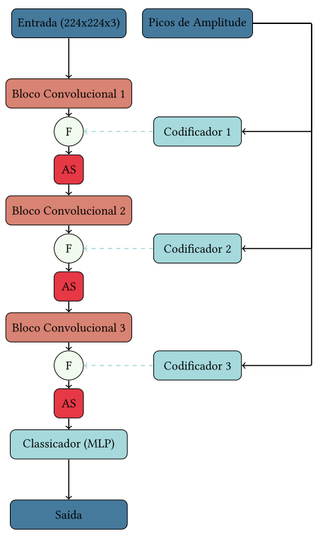
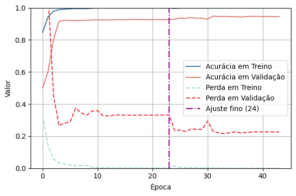

# SynthNET: Detecção de Deepfakes com Análise Híbrida Espacial e de Frequência

Este repositório contém o código, os dados e os resultados do projeto que propõe uma nova abordagem para a detecção de deepfakes. A arquitetura utiliza uma combinação de análise espacial e de frequência, explorando redes neurais convolucionais e características derivadas da transformada rápida de Fourier (FFT).

---

## Arquitetura da Rede

A arquitetura combina duas fontes de dados:
1. **Imagens**: Processadas por uma CNN para extração de características espaciais.
2. **Picos de frequência (FFT)**: Extraídos para capturar padrões específicos no domínio da frequência.

Os dados são fusionados em pontos específicos da rede para uma análise conjunta, seguidos por etapas de atenção espacial antes de prosseguir para convoluções adicionais.

<h4>Arquitetura da Rede</h4>


---

## Resultados

Os experimentos foram conduzidos utilizando um subconjunto do dataset DFDC. A abordagem alcançou:
- **Acurácia de Validação**: 92,66%
- **Acurácia Balanceada no Conjunto de Teste**: 75,25%
- **ROC AUC no Conjunto de Teste**: 83,23%

Embora os resultados iniciais sejam promissores, foi observada uma tendência ao overfitting, indicando que ajustes no conjunto de dados e na arquitetura podem melhorar o desempenho.



---

## Requisitos

- **Linguagem**: Python 3.8+
- **Bibliotecas**:
  - PyTorch
  - NumPy
  - Matplotlib
  - OpenCV
  - scikit-learn

Instale as dependências com o comando:

```bash
pip install -r requirements.txt
```
